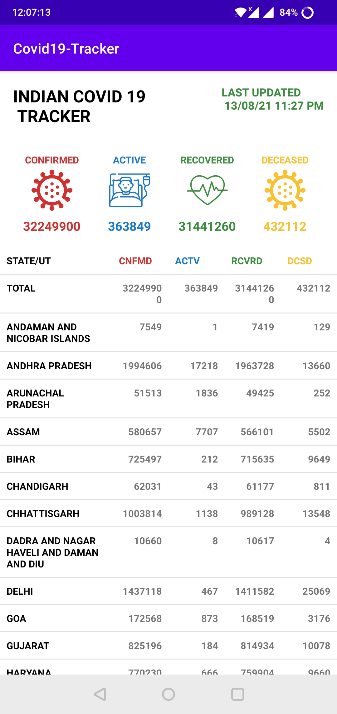

# Covid Tracker

## Technologies and Language Used

1. Android Studio
2. Kotlin

## About the App

1. User can see the number of covid cases in each state of India

## APK

```
https://drive.google.com/file/d/1fmSfs5mwRAYu--n3m5uV9jfkytK_lIFO/view?usp=sharing
```

<br>
<p align="center">
  
</p>
